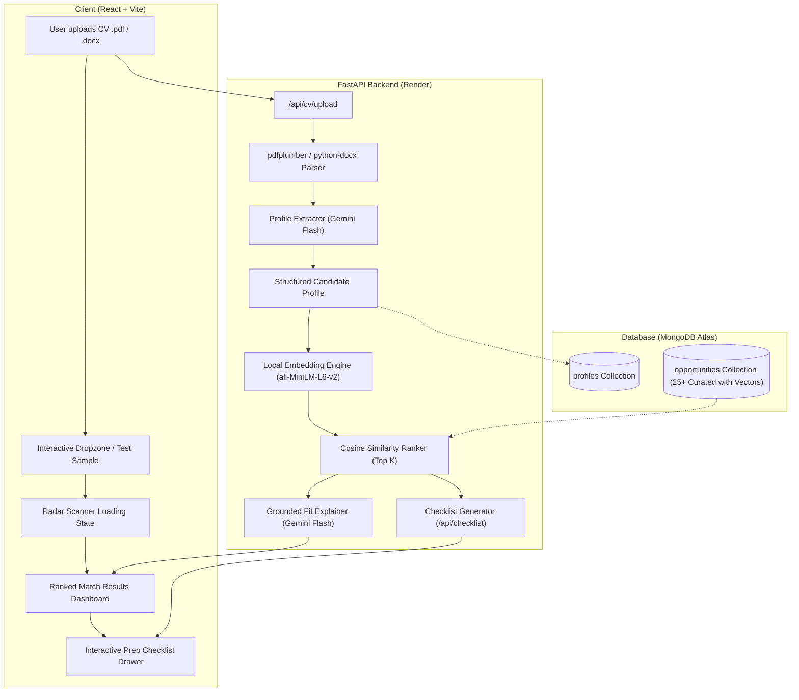

# Ace-Opportunity 🚀

> **AI-Powered Opportunity Matching Copilot**  
> Matches students and researchers to real, high-impact opportunities — internships, scholarships, and grants — based on their actual background and skills, not keyword guessing.

[](https://fastapi.tiangolo.com)
[](https://react.dev)
[](https://vitejs.dev)
[](https://www.mongodb.com/atlas)
[](https://huggingface.co/sentence-transformers/all-MiniLM-L6-v2)
[](https://ai.google.dev/)
[](backend/tests)
[](LICENSE)

**🔗 Live app:** https://ace-opportunity-public-repo.vercel.app
**🔗 API:** https://ace-opportunity-public-repo.onrender.com/api/health

---

## 🌟 Overview & Problem Statement

Traditional job and fellowship boards rely on brittle keyword search. Candidates miss life-changing opportunities simply because their CV uses different terminology than an applicant tracking system, or because they don't know which global programs fit their unique profile.

**Ace-Opportunity** bridges this gap:
1. **Reads your actual CV** (PDF or DOCX) and uses LLMs to extract a structured profile (skills, education, career experience, and interests).
2. **Projects your profile into 384-dimensional semantic vector space** using local sentence transformers (`all-MiniLM-L6-v2`) without third-party embedding API latency or cost.
3. **Ranks curated global opportunities** (internships, fellowships, grants) using dense cosine similarity against pre-computed opportunity vectors.
4. **Synthesizes grounded "Why You Fit" rationales** powered by Google Gemini, citing concrete experiences from your CV rather than generic praise.
5. **Generates actionable preparation checklists** with interactive checkboxes, document requirements, deadlines, and strategic prep advice for every top match.

---

## 🏗️ Architecture & Data Flow



---

## 🚀 Key Features

| Feature | Description |
|---|---|
| 📄 **Intelligent Document Ingestion** | Robust multi-format parsing for both PDF (via `pdfplumber`) and DOCX (via `python-docx`), with automatic UTF-8 text sanitization and structure preservation. |
| 🧬 **Structured Profile Extraction** | Extracts verified technical skills, degrees, career history, and research interests into validated Pydantic schemas, persisted to MongoDB Atlas. |
| ⚡ **Local Vector Similarity Engine** | Uses `sentence-transformers` (`all-MiniLM-L6-v2`, 384-dim) singleton running in-process for instantaneous vectorization without API rate limits or egress costs. |
| 🎯 **Curated Global Dataset** | 25+ verified, active opportunities across major technology, research, diversity, and fellowship programs (Google Summer of Code, NASA, Bloomberg, DeepMind, MLH, Rhodes, etc.). |
| 💡 **Grounded "Why You Fit" Rationales** | AI explanations strictly grounded in the candidate's exact background details, linking coursework and projects directly to program eligibility. |
| 📋 **Interactive Prep Checklist** | One-click checklist generator tailored to each opportunity: required documents (transcripts, letters, essays), deadlines, and prioritized action items. |
| 📱 **Responsive UI & Micro-interactions** | Circular SVG match meters, staged radar scan transitions, interactive strike-through checkboxes, and mobile-responsive layout. |

---

## 🛠️ Tech Stack

- **Backend:** Python 3.12+, FastAPI, Pydantic v2, Uvicorn
- **Database:** MongoDB Atlas via `motor` async driver
- **Embeddings:** `sentence-transformers` (`all-MiniLM-L6-v2`, 384 dimensions)
- **AI / LLM:** Google Gemini (`google-genai`) with fallback handling for Claude (`anthropic`)
- **Document Parsers:** `pdfplumber`, `python-docx`
- **Frontend:** React 18, Vite, Vanilla CSS design tokens & animations
- **Testing:** `pytest`, `pytest-asyncio`, `httpx` (31 tests passing)
- **Deployment:** Render (Backend) + Vercel (Frontend)

---

## 📦 Repository Structure

```
.
├── backend/
│   ├── app/
│   │   ├── core/
│   │   │   ├── config.py         # App settings & pydantic-settings
│   │   │   ├── db.py             # Async MongoDB client lifecycle
│   │   │   ├── embeddings.py     # Local sentence-transformers singleton
│   │   │   ├── llm.py            # Gemini / Claude profile & rationale calls
│   │   │   ├── matching.py       # Dense cosine similarity & ranking
│   │   │   └── seed.py           # Idempotent DB seeder
│   │   ├── models/
│   │   │   ├── cv.py             # Profile & CV Pydantic models
│   │   │   └── opportunity.py    # Opportunity & Match Pydantic models
│   │   ├── routers/
│   │   │   └── cv.py             # CV upload & parse routes
│   │   ├── routes/
│   │   │   ├── checklist.py      # Actionable prep checklist route
│   │   │   ├── match.py          # Opportunity matching route
│   │   │   └── opportunities.py  # Opportunity catalog routes
│   │   └── main.py               # FastAPI entrypoint & CORS middleware
│   ├── data/
│   │   └── opportunities.json    # Curated seed dataset (25+ entries)
│   ├── tests/                    # 31 unit, integration, and e2e tests
│   ├── requirements.txt
│   └── .env.example
├── frontend/
│   ├── src/
│   │   ├── components/
│   │   │   ├── ErrorMessage.jsx  # Dismissible error banners
│   │   │   ├── LoadingState.jsx  # Multi-stage radar scanner
│   │   │   ├── MatchCard.jsx     # Card with SVG meter & checklist drawer
│   │   │   ├── MatchResults.jsx  # Results grid & candidate header
│   │   │   └── UploadForm.jsx    # Drag-and-drop CV upload zone
│   │   ├── App.jsx               # Main state machine
│   │   ├── App.css               # Design tokens, typography & animations
│   │   └── main.jsx
│   ├── package.json
│   └── .env.example
├── docs/
│   └── DEMO_SCRIPT.md            # 60–90 second pitch & judge Q&A cheat sheet
├── ROADMAP.md                    # 7-day build progress tracker
└── README.md
```

---

## 💻 Local Development Setup

### Prerequisites
- Python 3.11+
- Node.js 18+ and npm
- A free [MongoDB Atlas](https://www.mongodb.com/atlas) cluster (or local MongoDB)
- A [Google Gemini API Key](https://aistudio.google.com/)

---

### 1. Backend Setup

```bash
# Navigate to backend directory
cd backend

# Create and activate virtual environment
python -m venv .venv
source .venv/bin/activate        # On Windows: .venv\Scripts\activate

# Install dependencies
pip install -r requirements.txt

# Configure environment variables
cp .env.example .env
```

Edit `backend/.env` with your credentials:
```env
GOOGLE_API_KEY="your-gemini-api-key"
MONGODB_URI="mongodb+srv://<user>:<password>@cluster.mongodb.net/?retryWrites=true&w=majority"
CORS_ORIGINS="http://localhost:5173,http://127.0.0.1:5173"
MOCK_LLM=false
```

Seed the database with the curated opportunities:
```bash
python -m app.core.seed
```

Run the backend development server:
```bash
uvicorn app.main:app --reload --port 8000
# → API Health Check: http://localhost:8000/api/health
# → Interactive Docs: http://localhost:8000/docs
```

---

### 2. Frontend Setup

```bash
# Navigate to frontend directory
cd ../frontend

# Install dependencies
npm install

# Configure environment variables
cp .env.example .env
```

Edit `frontend/.env`:
```env
VITE_API_URL=http://localhost:8000
```

Start the Vite development server:
```bash
npm run dev
# → Web App: http://localhost:5173
```

---

## 🧪 Testing

Run the comprehensive backend test suite (31 tests):

```bash
cd backend
python -m pytest tests -v
```

Test coverage includes:
- Multi-format file parsers (PDF, DOCX, empty documents)
- Vector embedding generation & dimensions
- Cosine similarity ranking & deterministic edge cases
- MongoDB async persistence & retrieval
- Grounded LLM extraction & explanation prompts
- End-to-end API routes (`/api/cv/upload`, `/api/match/{id}`, `/api/checklist`, `/api/opportunities`)

Verify frontend build:
```bash
cd frontend
npm run build
```

---

## 📡 API Specification

| Method | Endpoint | Description | Payload / Params |
|---|---|---|---|
| `GET` | `/api/health` | Liveness check | None |
| `POST` | `/api/cv/upload` | Upload PDF or DOCX file, extract profile & persist | Multipart `file` (`.pdf`, `.docx`) |
| `POST` | `/api/cv/parse` | Alias of `/api/cv/upload` (same multipart file upload) | Multipart `file` (`.pdf`, `.docx`) |
| `GET` | `/api/opportunities` | List curated opportunities (embeddings omitted) | Query: `type`, `limit`, `skip` |
| `GET` | `/api/match/{profile_id}` | Semantic match & grounded fit explanations | Path: `profile_id`, Query: `top_k` |
| `POST` | `/api/checklist` | Generate tailored application preparation checklist | JSON `{ "profile_id": "...", "opportunity_id": "..." }` |

---

## 🔐 Environment Variables Reference

### Backend (`backend/.env`)

| Variable | Required | Description |
|---|---|---|
| `GOOGLE_API_KEY` | **Yes** | Google Gemini API key used for profile extraction, fit explanations, and checklists. |
| `MONGODB_URI` | **Yes** | MongoDB Atlas connection string (or local connection URI). Database name is fixed to `ace_opportunity`. |
| `CORS_ORIGINS` | No | Comma-separated list of allowed origins (e.g. `http://localhost:5173,https://your-app.vercel.app`). |
| `MOCK_LLM` | No | Set to `true` to run offline with mocked LLM responses during testing. |
| `ANTHROPIC_API_KEY` | No | Optional Claude API key for secondary fallback. |

### Frontend (`frontend/.env`)

| Variable | Required | Description |
|---|---|---|
| `VITE_API_URL` | **Yes** | Backend URL base (e.g. `http://localhost:8000` for local, or Render URL for production). |

---

## 🎬 Live Demo & Pitch

A ready-to-deliver 60–90 second spoken presentation and judge Q&A cheat sheet is available in [docs/DEMO_SCRIPT.md](docs/DEMO_SCRIPT.md).

---

## 👥 Authors & Team

- **Ibrahim** ([@Ibrahim-KIA](https://github.com/Ibrahim-KIA)) — Engineering & Technical Lead
- **Ibukunoluwa Omidiji** — Product, Strategy & Research

---

## 📄 License

This project is licensed under the MIT License — see the [LICENSE](LICENSE) file for details.
